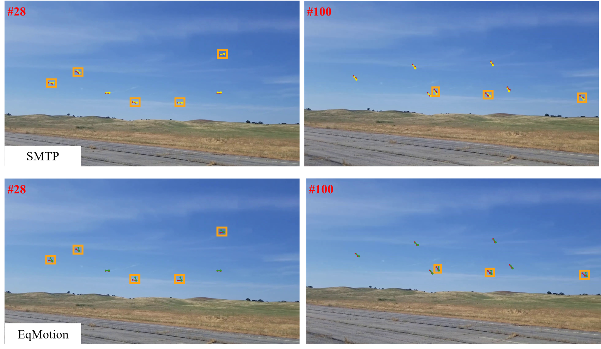
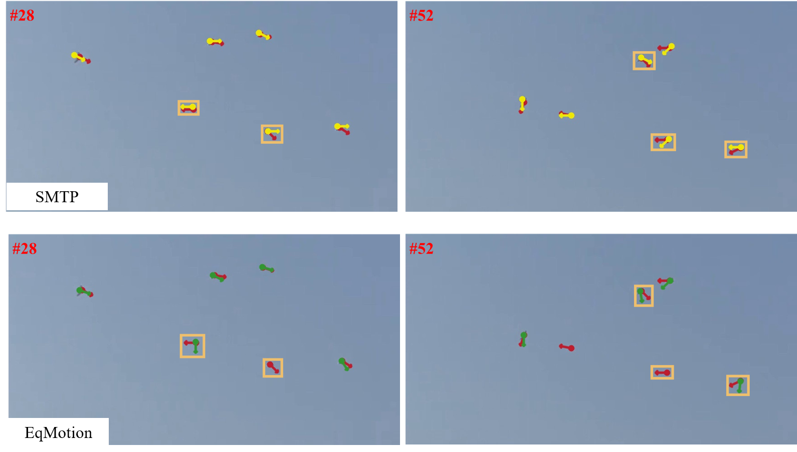
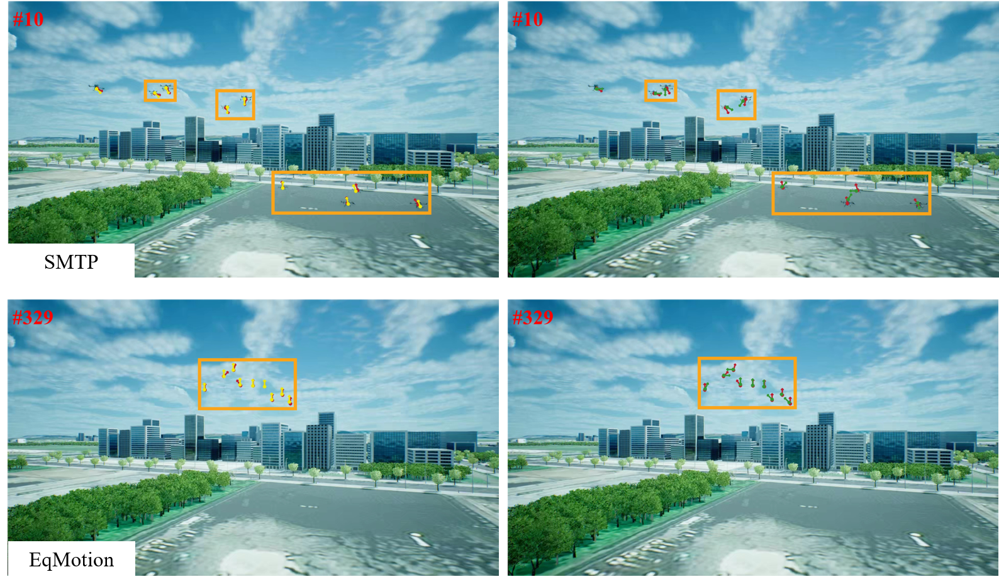

# SwarmTrack Performance Summary

## Title: SwarmTrack: Swarm-Coupled Motion Modeling and Trajectory-Guided Feature Fusion for Air-to-Air Multi-UAV Tracking

### Summary of the Method
SwarmTrack is a novel air-to-air multi-UAV tracking method designed to handle the challenges of small object sizes, weak visual cues, and complex nonlinear swarm behaviors in UAV tracking scenarios. It integrates two key modules:
1. **Swarm Motion-Aware Trajectory Prediction (SMTP)**: This module models historical trajectories and posture-aware appearance features to predict nonlinear, coupled group motion in a swarm.
2. **Trajectory-Guided Spatio-Temporal Feature Fusion (TG-STFF)**: This module generates guidance feature maps using predicted positions and historical features, which are fused with current frame features to ensure temporal consistency and spatial discriminability.

### Key Experimental Results

#### Table 1: Performance Comparison on AIRMOT, MOT-FLY, and UAVSwarm Datasets

| Dataset      | Method         | MOTA ↑    | IDF1 ↑    | HOTA ↑    | IDSW ↓  | FPS ↑ |
| ------------ | -------------- | --------- | --------- | --------- | ------- | ----- |
| **AIRMOT**   | FairMOT        | 18.19     | 17.41     | 17.56     | 476     | 35.2  |
|              | HOMATracker    | 30.08     | 29.31     | 25.55     | 506     | 20.0  |
|              | **SwarmTrack** | **32.30** | **30.15** | **25.54** | **476** | 21.8  |
| **MOT-FLY**  | ByteTrack      | 68.15     | 70.98     | 55.02     | 176     | 39.2  |
|              | HOMATracker    | 72.42     | 77.64     | 58.38     | 20      | 19.7  |
|              | **SwarmTrack** | **72.52** | **79.31** | **59.02** | **18**  | 22.1  |
| **UAVSwarm** | OCSORT         | 75.7      | 81.8      | 64.7      | 709     | 40.9  |
|              | HOMATracker    | 79.2      | 87.1      | 67.0      | 58      | 20.3  |
|              | **SwarmTrack** | **81.9**  | **88.4**  | **68.6**  | **56**  | 22.3  |

#### Key Results for SwarmTrack

1. ## 1. **SMTP Module - Quantitative and Qualitative Analysis**
   
   ### Trajectory Prediction Comparison
   The following figures show the comparison of trajectory prediction between different modules under typical air-to-air swarm tracking scenarios.
   
   
- (a) UAVSwarm-40
   
   
   - (b) UAVSwarm-58
   
   
   - (c) AIRMOT-01
   
   * Red dots and arrows denote ground-truth positions and motion directions.
   * Yellow dots and arrows indicate the predicted positions and directions by the SMTP module.
   * Green ones represent predictions by EqMotion.
   * Orange boxes highlight local regions where SMTP predictions align more closely with the ground-truth trajectories.
   
   ### Evaluation of the SwarmTrack with SMTP module on AIRMOT and UAVSwarm datasets
   | $T$          | MOTA↑     | IDF1↑     | HOTA↑     | IDSW↓   |
   | ------------ | --------- | --------- | --------- | ------- |
   | **AIRMOT**   |           |           |           |         |
   | 4            | **33.63** | 30.04     | 25.51     | **457** |
   | 8            | 32.30     | **30.15** | **25.54** | 476     |
   | 12           | 31.89     | 29.61     | 25.47     | 498     |
   | 16           | 31.12     | 28.85     | 25.38     | 513     |
   | **UAVSwarm** |           |           |           |         |
   | 4            | 81.86     | 88.15     | 68.33     | 59      |
   | 8            | **81.90** | **88.45** | **68.56** | **56**  |
   | 12           | 81.28     | 88.02     | 67.86     | 66      |
   | 16           | 80.99     | 87.30     | 67.25     | 61      |
   
   ### Comparison of different trajectory prediction modules on multi-object tracking performance
   | Algorithm           | MOTA↑     | IDF1↑     | HOTA↑     | IDSW↓   |
   | ------------------- | --------- | --------- | --------- | ------- |
   | **AIRMOT**          |           |           |           |         |
   | SwarmTrack-SMTP     | **32.30** | **30.15** | **25.54** | **476** |
   | SwarmTrack-EqMotion | 31.91     | 28.94     | 24.92     | 478     |
   | **UAVSwarm**        |           |           |           |         |
   | SwarmTrack-SMTP     | **81.90** | **88.45** | **68.56** | **56**  |
   | SwarmTrack-EqMotion | 80.95     | 87.08     | 67.42     | 73      |
   
   ## 2. **TG-STFF Module - Quantitative and Qualitative Analysis**
   
   ### Visualization of Feature Fusion in TG-STFF Module
   The following image shows the feature fusion process using different strategies within the TG-STFF module:
   
   
   - From left to right: ground-truth frame, raw feature map, fused feature map using the IMA strategy, and fused feature map using the TG-STFF module.
   - Orange boxes: correct detections; red: false positives; yellow: missed detections.
   
   ### Performance Comparison Using Different Feature Fusion Strategies
   
   #### AIRMOT Test Set
   | Algorithm             | IMA  | TG-STFF | MOTA↑     | IDF1↑     | HOTA↑     | IDSW↓   |
   | --------------------- | ---- | ------- | --------- | --------- | --------- | ------- |
   | FairMOT               |      |         | 18.19     | 17.41     | 17.56     | 476     |
   | FairMOT (IMA)         | ✅    |         | 21.19     | 19.78     | 19.38     | 516     |
   | FairMOT (TG-STFF)     |      | ✅       | **21.86** | **21.58** | **20.41** | **415** |
   | HOMATracker           |      |         | 30.08     | 29.31     | 25.55     | 506     |
   | HOMATracker (IMA)     | ✅    |         | 31.13     | 28.42     | 24.83     | 483     |
   | HOMATracker (TG-STFF) |      | ✅       | **32.30** | **30.15** | **25.54** | **476** |
   
   #### MOT-FLY Test Set
   | Method                | IMA  | TG-STFF | MOTA↑     | IDF1↑     | HOTA↑     | IDSW↓   |
   | --------------------- | ---- | ------- | --------- | --------- | --------- | ------- |
   | FairMOT               |      |         | **63.52** | 54.81     | 42.10     | 177     |
   | FairMOT (IMA)         | ✅    |         | 62.13     | 61.90     | 47.68     | 184     |
   | FairMOT (TG-STFF)     |      | ✅       | 62.96     | **63.52** | **48.32** | **172** |
   | HOMATracker           |      |         | 72.42     | 77.64     | 58.38     | 20      |
   | HOMATracker (IMA)     | ✅    |         | 72.46     | 77.90     | 58.53     | 18      |
   | HOMATracker (TG-STFF) |      | ✅       | **72.52** | **79.31** | **59.02** | **18**  |
   
   #### UAVSwarm Test Set
   | Method                | IMA  | TG-STFF | MOTA↑     | IDF1↑     | HOTA↑     | IDSW↓   |
   | --------------------- | ---- | ------- | --------- | --------- | --------- | ------- |
   | FairMOT               |      |         | 67.70     | 73.20     | 59.20     | 590     |
   | FairMOT (IMA)         | ✅    |         | 69.66     | 76.40     | 59.64     | 381     |
   | FairMOT (TG-STFF)     |      | ✅       | **71.29** | **77.50** | **60.55** | **372** |
   | HOMATracker           |      |         | 79.20     | 87.10     | 67.00     | 58      |
   | HOMATracker (IMA)     | ✅    |         | 79.43     | 87.76     | 67.31     | **49**  |
   | HOMATracker (TG-STFF) |      | ✅       | **81.90** | **88.45** | **68.56** | 56      |
   
   ---
   
   ### Summary of Key Results
   
   SwarmTrack, with the integration of the **SMTP** and **TG-STFF** modules, demonstrates superior performance in air-to-air swarm UAV tracking. The SMTP module enables accurate trajectory prediction by capturing the coupled motion dynamics within a swarm, while the TG-STFF module effectively fuses historical visual features with current frame information, significantly improving the detection and tracking process.
   
   1. **SMTP Module**: SwarmTrack-SMTP consistently outperforms EqMotion-based approaches, especially in terms of MOTA, IDF1, HOTA, and IDSW, achieving high tracking accuracy on both AIRMOT and UAVSwarm datasets.
   2. **TG-STFF Module**: SwarmTrack’s TG-STFF shows significant improvements in MOTA, IDF1, HOTA, and IDSW over FairMOT and HOMATracker across all test datasets, proving its effectiveness in handling complex visual and motion dynamics.
   
   These results validate SwarmTrack as a robust, efficient solution for air-to-air swarm UAV tracking, with superior accuracy and robustness in highly cluttered and dynamic environments.

### Lightweight Deployment on Edge Embedded Devices

SwarmTrack was optimized for real-time performance on embedded platforms. The following results demonstrate its efficacy on the NVIDIA Jetson Orin NX, a widely used AI platform for UAV applications:

| Dataset      | MOTA ↑ | IDF1 ↑ | HOTA ↑ | IDSW ↓ | FPS ↑ |
| ------------ | ------ | ------ | ------ | ------ | ----- |
| **AIRMOT**   | 30.68  | 28.72  | 24.31  | 502    | 23.98 |
| **MOT-FLY**  | 72.11  | 75.34  | 56.12  | 20     | 22.11 |
| **UAVSwarm** | 78.22  | 84.04  | 66.71  | 60     | 24.53 |

The lightweight SwarmTrack, optimized using TensorRT and a HOMATracker-Light backbone, achieves real-time inference on embedded devices without sacrificing tracking performance. This demonstrates the feasibility of deploying SwarmTrack on edge AI platforms for UAV tracking applications in dynamic environments.

### Conclusion
SwarmTrack effectively handles the complex challenges of air-to-air multi-UAV tracking, outperforming state-of-the-art trackers in both accuracy and robustness. By leveraging integrated motion-aware prediction and feature fusion techniques, it demonstrates strong generalization to various swarm behaviors and environmental conditions. The lightweight version further demonstrates its suitability for real-time deployment on edge devices, making it a practical solution for real-world UAV tracking tasks.

---

### Acknowledgments
We would like to thank the reviewers for their insightful comments and feedback that helped improve the quality of this work.

### Code Availability
The code for SwarmTrack will be made available at [CZC-123/SwarmTrack: the source code of SwarmTrack](https://github.com/CZC-123/SwarmTrack#). For more details on usage, please refer to the README file.

---